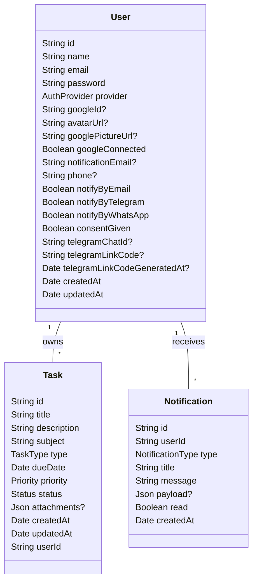

# TaskStudy

Gerenciador de tarefas acadêmicas focado em produtividade, clareza e lembretes inteligentes. O projeto oferece um fluxo enxuto para cadastrar, filtrar, acompanhar e concluir atividades (trabalhos, provas, leituras), com diferenciais em notificações por e-mail e integração com mensageria (Telegram; WhatsApp planejado) para evitar esquecimentos.

> Observação: este é um projeto acadêmico em evolução contínua, com foco em boas práticas full‑stack, automação de testes e UX responsiva.

## Principais funcionalidades

- Cadastro e acompanhamento de tarefas
  - Campos: título, descrição, matéria (subject), tipo (assignment, exam, reading), prioridade, prazo, status, anexos.
  - Filtros por status, matéria, tipo, prioridade, busca textual e intervalo de datas.
  - Indicadores: pendentes, concluídas, atrasadas e “due soon”.
- Lembretes e resumo diário
  - Lembretes automáticos por e‑mail quando a tarefa se aproxima do prazo (24h, 48h, 72h).
  - E‑mail de resumo com visão consolidada das tarefas pendentes para a semana.
- Integrações de notificação
  - E‑mail (SMTP configurável).
  - Telegram (linkagem de chatId e envio de mensagens do sistema).
  - WhatsApp (campo e preferência já previstos no modelo; implementação de envio real planejada).
- Acessibilidade e experiência
  - Menu de acessibilidade com preferências (alto contraste, leitura de tela, reduzir animações, comandos por voz – quando suportado).
  - UI responsiva, com overlay de menu em mobile e botão flutuante de nova tarefa alinhado ao conceito do botão de acessibilidade.
- Autenticação
  - Login local (email/senha) e suporte a Google OAuth (campos previstos; conexão ativada via configuração).

## Diferenciais

- Foco em “lembrar você do que importa”: e‑mails de lembrete + resumo diário, e canal extra pelo Telegram.
- Modelo de dados simples e objetivo (User, Task, Notification) que facilita auditoria e extensão.
- Infra preparada para deploy (Dockerfiles frontend/backend, render.yaml de referência) e testes automatizados no backend (unitário, integração e E2E com Playwright).

## Arquitetura (alto nível)

- Frontend: React + TypeScript + Vite + styled‑components.
  - Páginas: Dashboard com métricas, filtros, lista, formulários e botão flutuante.
  - Componentes: Navbar responsiva, TaskList, TaskForm, AccessibilityMenu, Charts.
- Backend: Node + Express + TypeScript + Prisma (SQLite no dev; PostgreSQL em produção).
  - Camadas: controllers, services (email, notificações), middlewares (auth), prisma.
  - Agendador (node‑cron) para lembretes periódicos e resumo diário.
- Banco: Prisma ORM; migrações sob `backend/prisma/migrations`.

### Diagrama UML (modelo de dados)



Enums principais: `TaskType { ASSIGNMENT, EXAM, READING }`, `Priority { LOW, MEDIUM, HIGH }`, `Status { PENDING, COMPLETED }`, `NotificationType { DAILY_SUMMARY, URGENT_ALERT }`, `AuthProvider { LOCAL, GOOGLE }`.

## Tecnologias

- Frontend: React 18, TypeScript, Vite, styled-components, React Router, Recharts, React Toastify.
- Backend: Express, TypeScript, Prisma, bcrypt, JSON Web Token, node‑cron, nodemailer.
- Testes: Jest, Supertest (integração), Playwright (E2E), Vitest no frontend (onde aplicável).
- Infra/Dev: Docker, Nginx (frontend estático), Render (exemplo de config), ESLint/Prettier.

## Testes

- Unitários e de integração no backend (`backend/tests/units`, `backend/tests/integration`).
- E2E com Playwright (`backend/tests/e2e`) cobrindo fluxos chave (auth, dashboard, tarefas).
- Cobertura pode ser coletada via `npm run test:coverage` (backend). 
- O frontend utiliza lint rigoroso e pode ser estendido com testes de componentes.

## Complexidade e métricas

- Camada de serviços concentra a maior complexidade:
  - `notificationService`: cálculo de “due soon”, janela de digest e envio multi‑canal, além de persistência de histórico em `Notification`.
  - `emailService`: template de e‑mails (reminder e digest) e resolução dinâmica do transporte SMTP.
- Controladores e middlewares mantêm baixa complexidade ciclomática por função (fluxos lineares de validação e delegação para services).
- Frontend foca em composição de componentes e estados locais, com responsabilidade separada (filtros, lista, formulários, acessibilidade). O esforço está na responsividade e acessibilidade.

Resumo aproximado de complexidade por área (qualitativo):
- Services (backend): média‑alta (agendamento, formatos de mensagem, integrações externas).
- Controllers/Middlewares: baixa para média (validação e orquestração).
- Frontend UI/UX: média (responsividade, estilos, acessibilidade).

## Como rodar localmente

Pré‑requisitos: Node 18+ e npm.

1. Instale dependências (raiz, backend, frontend):
   ```bash
   npm run install-all
   ```
2. Configure variáveis de ambiente (serão criadas cópias de exemplo):
   ```bash
   npm run setup:env
   ```
3. Execute em modo desenvolvimento (API e frontend):
   ```bash
   npm run dev
   ```
4. Acesse em: http://localhost:5173

## Deploy (Render)

- Dockerfiles prontos em `backend/` e `frontend/`.
- Exemplo de infraestrutura em `render.yaml` (serviço web para backend + site estático para frontend + banco). Ajuste as variáveis sensíveis pelo painel do Render.
- Backend: garantir `DATABASE_URL`, `JWT_SECRET`, credenciais SMTP e tokens do Telegram no ambiente. Execute migrações na fase de deploy (`npx prisma migrate deploy`).

## Segurança e privacidade

- Não versione `.env` reais. Use `backend/.env.example` e `frontend/.env.example` como referência.
- O projeto utiliza `.gitignore` para evitar leaks de segredos e artefatos de build/teste.

## Roadmap curto

- Envio real por WhatsApp (provider de API e webhook).
- Testes de componentes no frontend e casos adicionais de E2E.
- Preferências avançadas por usuário (janelas de envio, quiet hours, granularidade de lembrete).

---

Feito com foco em organização do estudo e em lembretes que realmente ajudam a concluir tarefas no prazo. Se tiver sugestões, abra uma issue ou PR!
